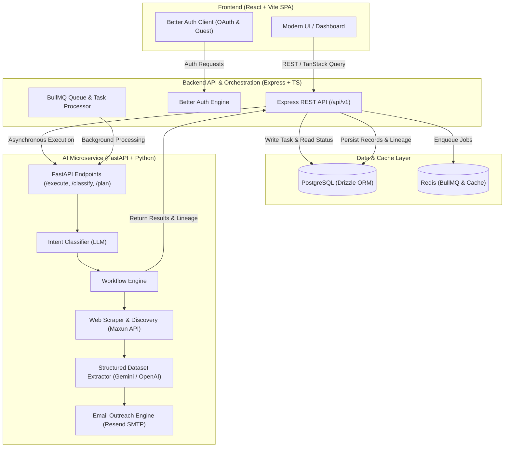

# DataPilot

AI-powered data intelligence platform for natural language data collection workflows.

**Live Demo:** [https://datapilot-frontend-e6gi.onrender.com/auth/sign-in](https://datapilot-frontend-e6gi.onrender.com/auth/sign-in)

---

## System Architecture

DataPilot is architected as a decoupled microservices-based system designed for asynchronous, AI-driven web scraping and data extraction.



### Architecture Layers

1. **Frontend (`frontend/`)**
   - **Framework:** React 18 with Vite and TypeScript.
   - **Styling & UI:** Tailwind CSS, shadcn/ui primitives, Lucide icons, and Recharts for dataset visualization.
   - **State & Data Fetching:** TanStack Query (React Query) for caching and polling active workflow status, and Better Auth client for authentication state.
   - **Pages:** Interactive Dashboard, Workflow Trigger & Live Tracking, Dataset Visualizer & Exporter (CSV/JSON), and Authentication view.

2. **Backend API (`backend/`)**
   - **Runtime:** Node.js, Express, TypeScript.
   - **Authentication:** Integrated Better Auth supporting Google & GitHub OAuth, email/password, and cookie-based Anonymous Guest Sessions.
   - **Task Orchestration:** Receives natural language prompts, creates task records, manages execution lifecycle (pending → running → completed/failed), and delegates execution to the AI service.
   - **Background Queue:** BullMQ backed by Redis for resilient background job queueing.

3. **AI & Extraction Microservice (`ai/`)**
   - **Runtime:** Python 3.12, FastAPI, Uvicorn.
   - **Intent Classification:** Analyzes user prompts into distinct intent types (`scrape`, `plan`, `general`) and extracts entity, location, and target record quotas.
   - **Web Scraping & Discovery:** Discovers live web sources dynamically using custom search algorithms and Maxun API integration.
   - **Data Intelligence & Deduplication:** Prompts LLMs (Google Gemini / OpenAI) to extract clean, tabular JSON schemas from raw web text and removes duplicates.
   - **Cold Outreach Automation:** Generates tailored outreach emails for extracted organizations and dispatches them via Resend SMTP (or simulation mode).

4. **Database & Persistence (`db/`)**
   - **Database:** PostgreSQL managed using Drizzle ORM and Drizzle Kit migrations.
   - **Key Entities:** Users, Sessions, Accounts, Guest Sessions, `collection_tasks` (task progress, execution steps, generated plans), and `collection_results` (extracted JSON records and source lineage).

---

## Project Structure

```
.
├── frontend/          # React + Vite SPA (Client web interface)
├── backend/           # Node.js + Express REST API & Task Processor
├── ai/                # Python FastAPI AI microservice & workflow engine
├── db/                # Drizzle ORM schema, relations, & migrations
└── render.yaml        # Infrastructure as Code specification for Render
```

---

## Tech Stack

- **Frontend:** React, Vite, TypeScript, Tailwind CSS, shadcn/ui, TanStack Query, Zustand, Recharts
- **Backend:** Node.js, Express, TypeScript, Zod, BullMQ, Redis
- **AI Microservice:** FastAPI, Python, Google Gemini, OpenAI, Maxun API, BeautifulSoup, Resend
- **Database:** PostgreSQL, Drizzle ORM
- **Authentication:** Better Auth (Google OAuth, GitHub OAuth, Email/Password, Guest Sessions)

---

## Getting Started

### 1. Prerequisites
- Node.js (v18+)
- Python (v3.11+)
- Docker & Docker Compose (for local PostgreSQL & Redis)

### 2. Environment Configuration
Copy `.env.example` in `backend/`, `frontend/`, and `ai/` directories and fill in required API keys (Gemini API key, Database URL, Redis URL, Resend API key).

### 3. Start Local Infrastructure
```bash
docker-compose up -d
```

### 4. Service Setup
- Frontend setup: see `frontend/README.md`
- Backend setup: see `backend/README.md`
- AI service setup: see `ai/README.md`
- Database setup: see `db/README.md`
